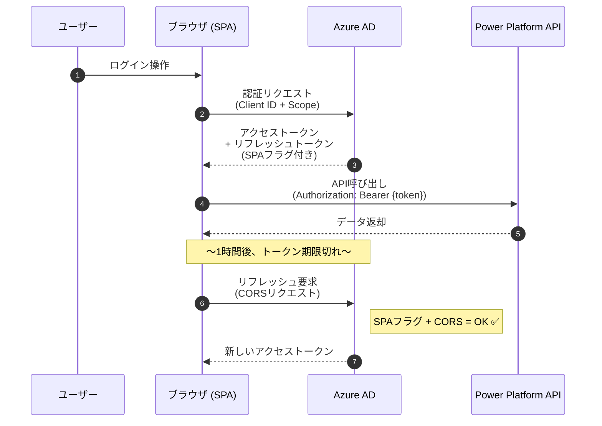
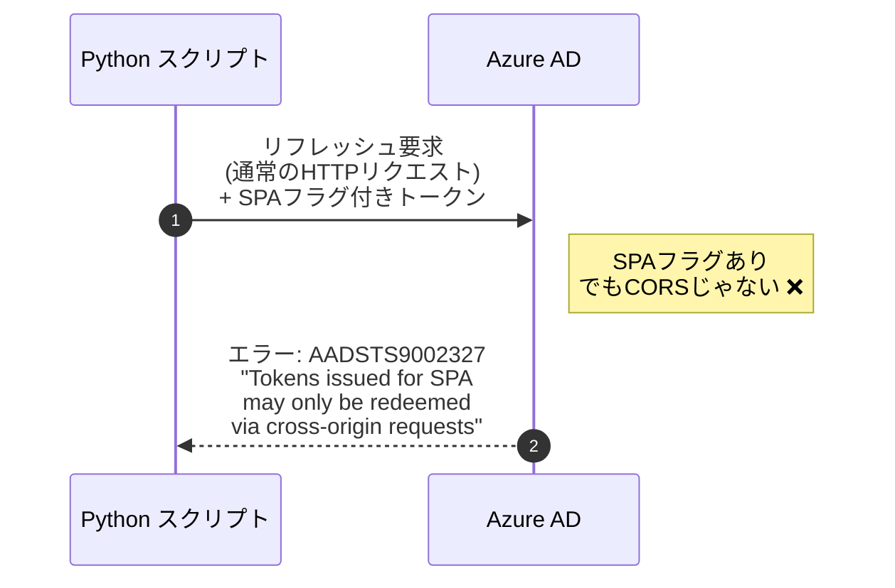
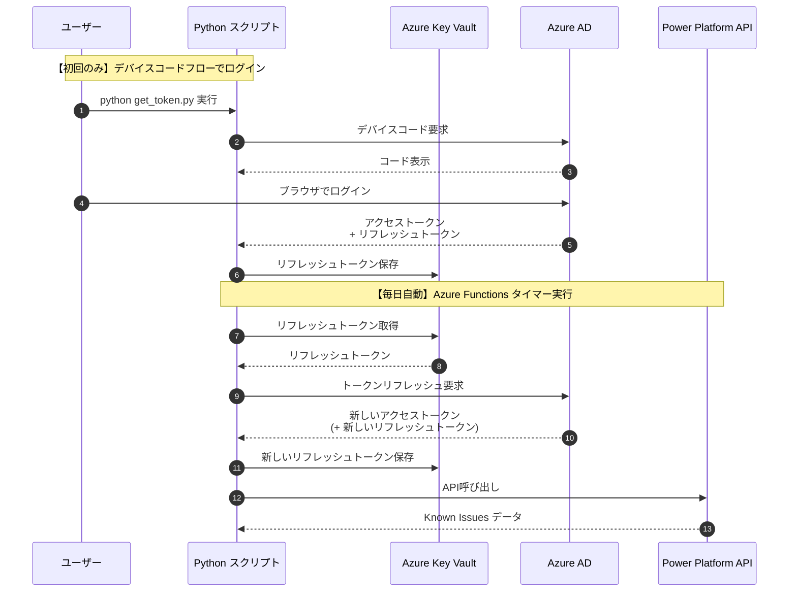
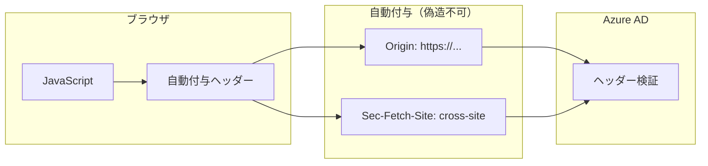
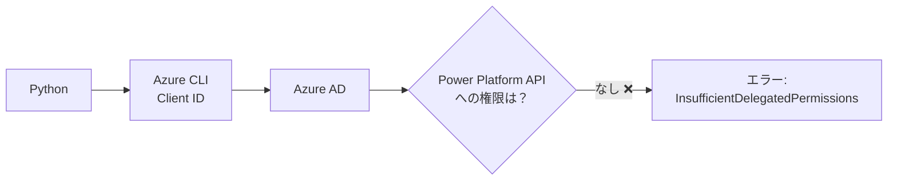
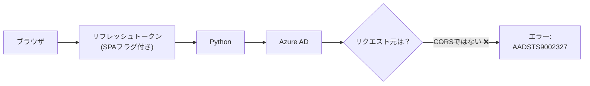
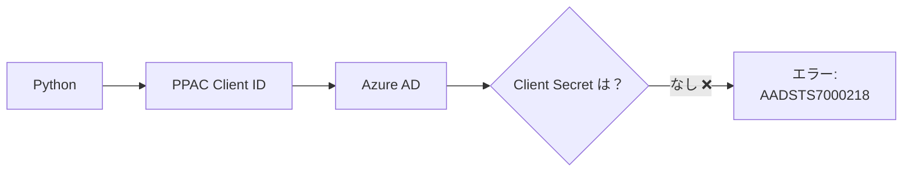
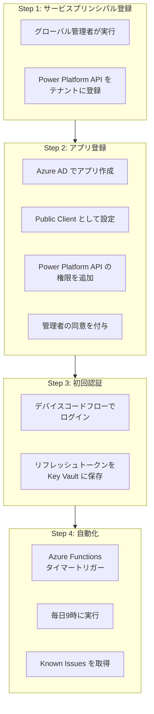
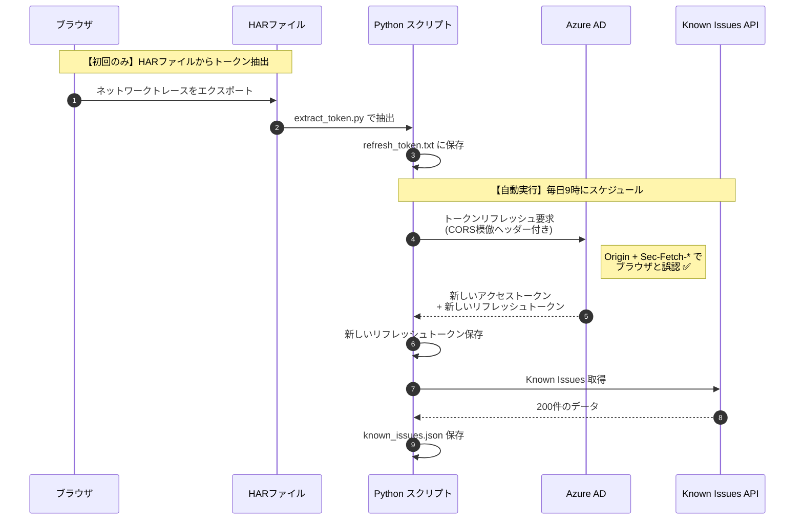

# Power Platform Known Issues API 自動化 - 技術調査ドキュメント

## 1. プロジェクトの目的

Power Platform の「既知の問題（Known Issues）」を自動取得するシステムを構築する。

### 要件
- 毎日9時に自動実行
- アクセストークンの自動リフレッシュ
- 人手による認証操作を不要にする

### 対象API
```
POST https://{tenant-id}.tenant.api.powerplatform.com/support/knownissue/search?api-version=2022-03-01-preview
```

---

## 2. OAuth 2.0 の基本概念

### 2.1 クライアントID（Client ID）とは

**クライアントID** = アプリケーションの「身分証明書番号」

Azure AD に登録された各アプリケーションには一意のIDが割り当てられます。

| アプリ名 | Client ID | 用途 |
|---------|-----------|------|
| Power Platform Admin Center | `065d9450-1e87-434e-ac2f-69af271549ed` | ブラウザでの管理画面 |
| Azure CLI | `04b07795-8ddb-461a-bbee-02f9e1bf7b46` | コマンドラインツール |
| Power Platform API | `8578e004-a5c6-46e7-913e-12f58912df43` | APIリソース |

### 2.2 スコープ（Scope）とは

**スコープ** = トークンに付与される「権限の範囲」

```
https://api.powerplatform.com/Support.Tickets.Read
                │                      │
                │                      └── 権限名（サポートチケット読み取り）
                └── リソース（Power Platform API）
```

### 2.3 オーディエンス（Audience）とは

**オーディエンス** = トークンの「宛先」

アクセストークンには「どのAPIで使えるか」が記録されています。

```json
{
  "aud": "https://api.powerplatform.com",  // ← このAPIでのみ使用可能
  "scp": "Support.Tickets.Read",            // ← 許可された操作
  "exp": 1767373577                         // ← 有効期限
}
```

---

## 3. トークンの種類と有効期限

| トークン | 有効期限 | 用途 |
|---------|---------|------|
| アクセストークン | 約1時間 | API呼び出しに使用 |
| リフレッシュトークン | 数日〜90日 | 新しいアクセストークンの取得に使用 |

### 重要なポイント
- アクセストークンは短命なので、リフレッシュトークンで定期的に更新が必要
- リフレッシュトークンは使用するたびに新しいものが発行されることがある
- 新しいリフレッシュトークンが発行されたら、必ず保存を更新する

---

## 4. OAuth 2.0 トークンフロー

### 4.1 正常なフロー（ブラウザ - SPA）



### 4.2 失敗したフロー（Python からのリフレッシュ試行）



### 4.3 理想的なフロー（独自アプリ登録）



---

## 5. CORSとは

**CORS = Cross-Origin Resource Sharing（クロスオリジン リソース共有）**

### 5.1 Originとは

```
URL: https://admin.powerplatform.microsoft.com/support/issues
     └─────────────────────────────────────┘
                    ↑
            これが Origin
```

Origin = プロトコル + ドメイン + ポート

### 5.2 ブラウザの「正直さ」



ブラウザは自動的に以下のヘッダーを付与し、**JavaScript から変更できません**：

| ヘッダー | 説明 |
|---------|------|
| `Origin` | リクエスト元のドメイン |
| `Sec-Fetch-Site` | same-origin / cross-site など |
| `Sec-Fetch-Mode` | cors / navigate など |
| `Sec-Fetch-Dest` | document / empty など |

---

## 6. アプリケーションの種類

| 種類 | 動作環境 | Client Secret | リフレッシュトークンの使用 | 例 |
|------|---------|---------------|--------------------------|-----|
| **SPA** (Single-Page Application) | ブラウザ上 | なし | ブラウザからのみ（CORS必須） | Power Platform Admin Center |
| **Public Client** | デスクトップ / CLI / モバイル | なし | どこからでも使用可能 | Azure CLI, モバイルアプリ |
| **Confidential Client** | サーバーサイド | あり | サーバーからのみ | Web API, バックエンドサービス |

### Power Platform Admin Center の場合

| 項目 | 値 |
|------|-----|
| Client ID | `065d9450-1e87-434e-ac2f-69af271549ed` |
| 種類 | SPA + Confidential Client |
| 制限 | リフレッシュトークンはブラウザからのみ使用可 |

---

## 7. 試行した方法と結果

### 7.1 Azure CLI の Client ID を使用



**結果**: Azure CLI は Power Platform API への事前承認がないため失敗

### 7.2 ブラウザのリフレッシュトークンを流用



**結果**: SPAトークンはブラウザからのみ使用可能なため失敗

### 7.3 Power Platform Admin Center の Client ID を使用



**結果**: Confidential Client として構成されているため、Client Secret が必要

---

## 8. 解決策

### 8.1 必要な手順



### 8.2 必要な権限

| 操作 | 必要な権限 |
|------|-----------|
| サービスプリンシパル登録 | グローバル管理者 |
| アプリ登録 | アプリケーション管理者 |
| 管理者の同意 | グローバル管理者 または アプリケーション管理者 |

---

## 9. 用語集

| 用語 | 説明 |
|------|------|
| **OAuth 2.0** | 認可のための業界標準プロトコル |
| **Client ID** | アプリケーションの一意識別子 |
| **Scope** | トークンに付与される権限の範囲 |
| **Audience (aud)** | トークンの宛先（どのAPIで使えるか） |
| **Access Token** | API呼び出しに使用する短命のトークン（約1時間） |
| **Refresh Token** | 新しいアクセストークンを取得するための長命のトークン |
| **CORS** | Cross-Origin Resource Sharing。ブラウザのセキュリティ機構 |
| **SPA** | Single-Page Application。ブラウザ上で動作するアプリ |
| **Public Client** | Client Secret を持たないアプリ（CLI、デスクトップ等） |
| **Confidential Client** | Client Secret を持つサーバーサイドアプリ |
| **Service Principal** | テナント内でのアプリケーションのインスタンス |
| **Device Code Flow** | デバイスコードを使った認証フロー。CLI等で使用 |

---

## 10. 現在のステータス

### ✅ CORS模倣による解決（実験的）

管理者権限なしで動作する方法を発見しました。



### 使用方法

```bash
# 初回: HARファイルからトークン抽出
python extract_token.py network_trace.har

# 実行
python known_issues_automation.py
```

### 注意事項

| 項目 | 内容 |
|------|------|
| **メリット** | 管理者権限不要で即座に動作 |
| **リスク** | Microsoftがセキュリティを強化すると動作しなくなる可能性 |
| **トークン有効期限** | 約90日（定期的に使用すれば延長される） |
| **推奨** | 正規の方法（独自アプリ登録）が使えるなら、そちらを優先 |

---

## 関連ドキュメント

CORS模倣の仕組みについてより詳しく知りたい場合は、[cors-mimicry-explained.md](cors-mimicry-explained.md) を参照してください。
